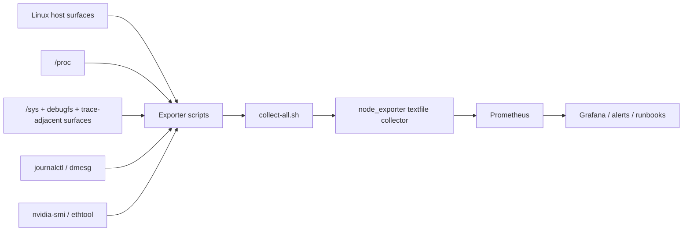

# AI Host Observability

Prometheus-friendly Linux host observability for AI and GPU infrastructure: memory pressure, RDMA/NIC health, GPUs, PCIe/VFIO, NUMA, filesystem pressure, process locked memory, and kernel-event signals.

## Description

`ai-host-observability` collects host-side pressure signals that are easy to miss when only guest RAM, GPU HBM, or application metrics are visible. It is designed for accelerated Linux servers where hidden host pressure often shows up first in reclaim, PSI, RDMA registration footprint, IRQ load, BAR1 usage, or kernel logs.

## GitHub Topics

`observability,prometheus,node-exporter,linux,gpu,rdma,infiniband,nvidia,mlx5,numa,vfio,pcie,ai-infrastructure,sre,performance-engineering`

## Collection Architecture



## What It Monitors

- host memory pressure from `/proc/meminfo`
- memory and CPU PSI from `/proc/pressure/*`
- reclaim and swap counters from `/proc/vmstat`
- `mlx5` `fw_pages_total` from debugfs
- cgroup v2 memory current, events, and pressure
- RDMA / InfiniBand counters
- selected `ethtool -S` counters
- softirq and selected IRQ counters
- NUMA memory and hit/miss counters
- kernel log patterns for OOM, PCIe/AER, VFIO, IOMMU, RDMA, and GPU driver issues
- NVIDIA GPU telemetry through `nvidia-smi`
- disk/filesystem pressure
- generic `/proc/net` network stack counters
- per-process locked memory
- PCIe/VFIO/IOMMU visibility

## Quick Triage Workflow

1. Check `nixl_host_meminfo_bytes{field="memavailable"}` and `nixl_host_memory_psi_avg`.
2. Check `nixl_host_fw_pages_sum` for hidden RDMA registration growth.
3. Compare GPU HBM and BAR1 signals against host memory pressure.
4. Inspect softnet drops, IRQ load, and NIC/RDMA errors.
5. Correlate with kernel log pattern counters.

## Install

### Requirements

- Linux host
- Bash
- `node_exporter` textfile collector
- `journalctl` recommended
- `ethtool` recommended
- `nvidia-smi` optional
- `debugfs` mounted if you want `fw_pages_total`

### Manual Install

```bash
git clone https://github.com/manishklach/ai-host-observability.git
cd ai-host-observability
make test
sudo make install
sudo systemctl daemon-reload
sudo systemctl enable --now ai-host-observability.timer
```

### node_exporter Textfile Collector

Make sure `node_exporter` is started with a textfile collector directory such as:

```bash
--collector.textfile.directory=/var/lib/node_exporter/textfile_collector
```

Run the collector manually:

```bash
OUT_DIR=/var/lib/node_exporter/textfile_collector bash scripts/collect-all.sh
```

### systemd Timer

The timer runs every minute and writes `.prom` files into `/var/lib/node_exporter/textfile_collector` by default.

```bash
sudo systemctl status ai-host-observability.timer
sudo systemctl status ai-host-observability.service
```

### Prometheus

Prometheus scrapes `node_exporter`; this repo does not expose its own HTTP server. Import the alert rules from `prometheus/alerts.yml`.

## Grafana

Import `grafana/ai-host-overview.json` into Grafana and connect it to your Prometheus datasource.

## Sample Metrics

```text
nixl_host_fw_pages_sum 1234 1710000000
nixl_host_meminfo_bytes{field="memavailable"} 2147483648 1710000000
nixl_gpu_bar1_used_bytes{index="0",uuid="GPU-123"} 536870912 1710000000
ai_host_exporter_last_run_success{exporter="nixl_host_mem"} 1 1710000000
```

## Tested Environments

- WSL `Ubuntu-24.04` for syntax and fixture-backed tests
- generic Linux hosts without requiring RDMA or GPU hardware for CI

## Limitations

- hardware-specific metrics remain absent when the hardware is absent
- some counters depend on kernel, driver, and firmware support
- PCIe and VFIO depth is intentionally lightweight and log-oriented
- this is a textfile collector toolkit, not a long-running agent

## Optional Dependencies

- `shellcheck` for linting
- `jq` for dashboard validation and formatting
- `systemd-analyze` for unit validation
- `shfmt` for shell formatting

## Documentation

- [Metrics contract](docs/metrics.md)
- [Runbooks](docs/runbooks)
- [Kernel debugging guide](KERNEL_DEBUGGING.md)
- [Testing guide](TESTING.md)
- [Signal cheat sheet](docs/signals.md)

